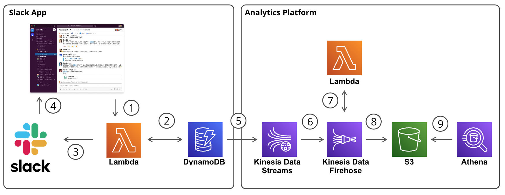

# System Diagram



# How to Set Up

## Terraform
AWS resources are managed by Terraform. They can be provisioned using the operations below.

```
# create function and layer zip files
sh build-lambda.sh

cd tf-assets/

# set environment variables
export TF_VAR_slack_token=xxxx
export TF_VAR_slack_signing_secret=yyyy

# create resources
terraform apply
terraform plan

# reset resources
terraform destroy
```

The following is the manual operation.
- Enable Function URL on AWS Console.
- Veiry the function URL on Slack API page.
  - https://api.slack.com/events/url_verification
  - To verify the Function URL, it is necessary to respond to the challenge parameter sent from Slack. Below is an example of a function for verification purposes.
  ```
    def lambda_handler(event, context):
        logger.info(event)
        
        body = json.loads(event['body'])
        return {
            'statusCode': 200,
            'body': json.dumps(
                {'challenge': body['challenge']},
            ),
        }
  ```
### Terraform destroy Tips
- You need to empty the S3 bucket before running `terraform destroy`.
- CloudWatch Logs won't be automatically deleted, so please manually delete the Log Group and Log Stream.

# DynamoDB
There are tables named `Messages` and `UserCounts`, each defined as follows:

Messages
- username (PK) : String
- time_to_username (SK) : String
- from_username: String
- to_username : String
- message : String
- incr_num : Number

UserCounts:
- username (PK): String
- total_num : Number

# How to Test
You can execute the test code using `pytest`. By running the `pytest` command without arguments, it will execute all test codes under the `tests/` directory.

```
# set environment variables
export SLACK_TOKEN=xxxx
export SLACK_SIGNING_SECRET=yyyy

cd $PROJECT_ROOT
pytest
```

If you want to run a specific test code, specify the target file as an argument like the following:

```
pytest tests/test_verify_request.py
```

Some of the tests use secret data (such as Slack Token) defined in `tests/secret_config.py`. Therefore, you need to prepare various secret information in advance, referring to `secret_config.py.dummy`.

